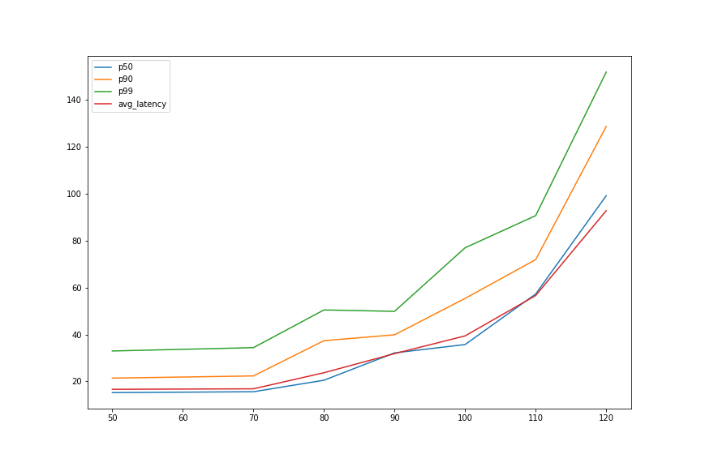

# TensorFlow Serving benchmark
Tool for benchmarking TensorFlow Serving.

## Usage

```sh
# Install dependencies
pip3 install tensorflow
pip3 install tensorflow-serving-api
pip3 install pandas
pip3 install matplotlib

# For benchmarking Triton
pip3 install nvidia-pyindex
pip3 install tritonclient[all]

# Start model server in another terminal
docker run -p 8500:8500 -p 8501:8501 \
  --mount type=bind,source=...,target=/models/default \
  -e MODEL_NAME=default -t tensorflow/serving

# Run benchmark
python3 tensorflow_serving_benchmark/benchmark.py --port=8500 --mode='grpc' --jsonl_file_path=...

# Or you can use benchmark_runner to that can also start model server for you:
# (following example is for Jupyter Notebook)
server_command = """
docker run -p 8500:8500 -p 8501:8501 \
 --mount type=bind,source=/<model_path>/,target=/models/default \
    -it tensorflow/serving:2.8.2 \
    --model_base_path=/models/default   \
    --model_name=default
"""
!python3 tensorflow_serving_benchmark/benchmark_runner.py \
    --title='...' \
    --model_name='default' \
    --signature_name='serving_default' \
    --host='localhost' \
    --port=8500 \
    --jsonl_file_path="..." \
    --qps_range='[1,3,5,8,10]' \
    --num_seconds=5 \
    --num_warmup_requests=2 \
    --num_warmup_delay_seconds=2 \
    --workers=1 \
    --mode='grpc' \
    --distribution='uniform' \
    --csv_report_filename='...csv' \
    --health_check_uri="http://localhost:8501/v1/models/default" \
    --keep_server_alive=true \
    --server_command="$server_command"
```


## Flags
```
benchmark.py:
  --api_key: API Key for ESP service if authenticating external requests.
    (default: '')
  --authorization_header: Authorization header to send with REST requests.
    For Cloud AI it can be set as "Bearer `gcloud auth print-access-token`"
    (default: '')
  --batch_size: Per request batch size.
    (default: '8')
    (an integer)
  --csv_report_filename: Filename to generate report.
    (default: '')
  --distribution: <uniform|poisson|pareto>: Load distribution type.
    (default: 'uniform')
  --grpc_compression: <none|deflate|gzip>: gRPC compression
    (default: 'none')
  --grpc_destination: gRPC destination metadata header.
    When using VPC peering on Cloud AI it should be set as <model-name>-<version-name>
    (default: '')
  --host: Host name to connect to, localhost by default.
    (default: 'localhost')
  --jsonl_file_path: The path the dataset file in jsonl format.
    (default: '')
  --input_name: The name of the model input tensor.
    (default: 'input')
  --mode: <grpc|sync_grpc|rest>: Benchmark mode: gRPC, synchronous gRPC, or REST
    (default: 'grpc')
  --model_name: Name of the model being served on the ModelServer
    (default: '')
  --num_requests: Total # of requests sent.
    (an integer)
  --num_seconds: Total # of seconds to run benchmark for.
    (an integer)
  --num_warmup_requests: Number of warmup requests to send before benchmark.
    (default: '0')
    (an integer)
  --port: Port to connect to.
    (an integer)
  --qps_range: Desired client side request QPS inone of the following formats:
        - qps - benchmark at one QPS
        - start, stop - benchmark at QPS range [start, stop)
        - start, stop, step - benchmark at QPS range [start, stop) with step
        - [qps1, qps2] - benchmark at give QPS range values
    (default: '')
  --request_timeout: Timeout for inference request.
    (default: '300.0')
    (a number)
  --requests_file_path: The path to the requests file in json format.
    (default: '')
  --signature_name: Name of the model signature on the ModelServer
    (default: 'serving_default')
  --tfrecord_dataset_path: The path to data in tfrecord or tfrecord.gz format.
    (default: '')
  --workers: Number of workers.
    (default: '1')
    (an integer)
```

```
benchmark_runner.py:
same flags as benchmark.py plus:
  --server_command: Command to start Model Server.
  --health_check_uri: Uri to check that Model Server is stared.
  --startup_timeout_seconds: Timeout for Model Server startup
    (default: '180')
  --keep_server_alive: Whether to keep Model Server alive after benchmark is completed.
```


## Usage notes
- You can specify `jsonl_file_path`, `requests_file_path` or `tfrecord_dataset_path` argument to load data.
- If there are not enough records in input files, tool will loop over existing requests.
- Requests are sent asynchronously, if tool can't send requests at specified QPS rate, it will report average request miss rate. You can use more workers to workaround it and benchmark at higher QPS.
- If you specify `csv_report_filename` tool will also generate graph with latency distribution like this one:


## Generating combined graphs from several runs

When benchmark is executed, there is a flag to dump results file to `csv_report_filename` and name that run using `title` flag.
When you run several benchmark and dump result csv files to a single folder, you can generate graph combining data from those runs.

Here is example how to do that from Jupyter Notebook:
```python
from graph_generator import *
matplotlib.rcParams['figure.figsize'] = [12.0, 10.0]
r = !ls results/*.csv
g = generate_avg_latency_graph(
    r,
    max_y=100,
    title='... average latency', min_x=0)
g.savefig('results/.._average_latency.png', bbox_inches='tight')

g = generate_p99_latency_graph(
    r,
    max_y=100,
    title='p99 latency', min_x=0)

g.savefig('results/..._p99_latency.png', bbox_inches='tight')
```

See `graph_generator.py` for details.